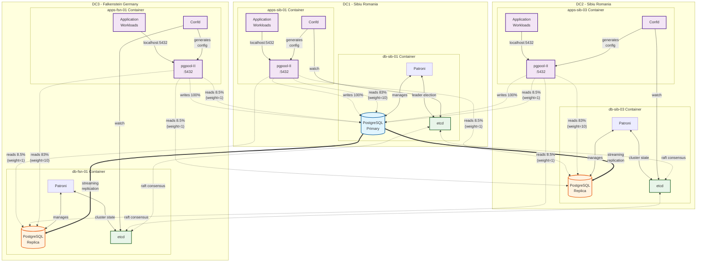
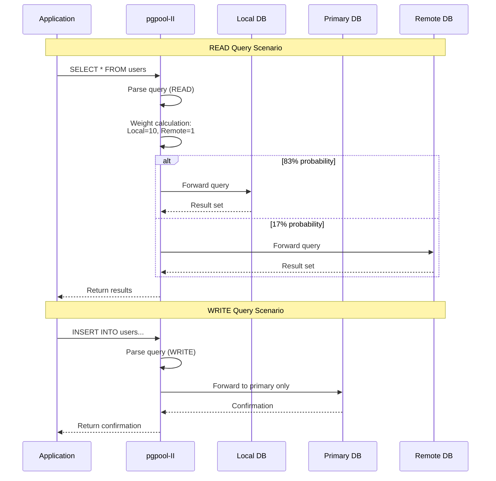
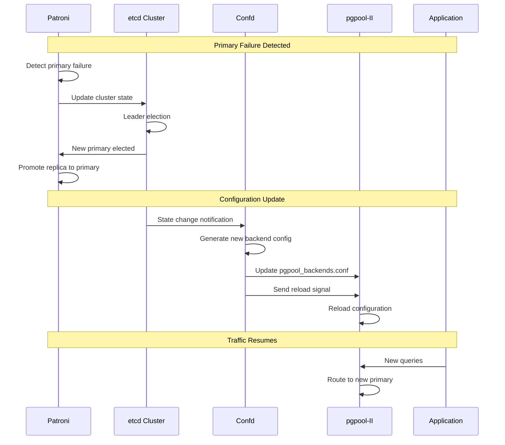

# Database Architecture Diagram

## Overview Architecture



## Component Interactions

### 1. Normal Operation Flow



### 2. Failover Scenario



## Routing Scenarios

### Scenario 1: Read from DC2 Application
```
Application (DC2) → pgpool-II (DC2) → Weight-based routing:
  - 83% chance → PostgreSQL Replica (DC2) [weight=10]
  - 8.5% chance → PostgreSQL Primary (DC1) [weight=1]  
  - 8.5% chance → PostgreSQL Replica (DC3) [weight=1]
```

### Scenario 2: Write from DC3 Application
```
Application (DC3) → pgpool-II (DC3) → PostgreSQL Primary (DC1)
  - All writes go to primary regardless of location
  - pgpool identifies write queries and routes accordingly
```

### Scenario 3: Primary Failover (DC1 → DC2)
```
Before: DC1=Primary, DC2=Replica, DC3=Replica
After:  DC2=Primary, DC1=Down, DC3=Replica

1. Patroni detects DC1 failure
2. etcd coordinates election, DC2 becomes primary
3. Confd detects change in etcd
4. Confd updates all pgpool configurations
5. pgpool reloads, writes now go to DC2
```

## Data Flow Components

### pgpool-II Configuration
- **Load Balance Mode**: Enabled for read distribution
- **Master/Slave Mode**: Stream replication mode
- **Query Parser**: Identifies read vs write queries
- **Backend Weights**: Local=10, Remote=1
- **Connection Pooling**: Transaction mode
- **Environment-based routing**: Uses LOCAL_DATACENTER variable

### Confd Template Logic
```go
// Pseudo-code representation of Confd template
local_dc := getenv("LOCAL_DATACENTER")  // Set via systemd override

// Static backend configuration with dynamic weights
backend0_ip := getv("/local/ips/dc1")
backend0_weight := (local_dc == "dc1") ? 10 : 1

backend1_ip := getv("/local/ips/dc2")  
backend1_weight := (local_dc == "dc2") ? 10 : 1

backend2_ip := getv("/local/ips/dc3")
backend2_weight := (local_dc == "dc3") ? 10 : 1
```

### Weight-Based Distribution
- Local server gets 10/(10+1+1) = 83.3% of reads when all healthy
- With 3 servers total: Local=10, Remote1=1, Remote2=1
- Actual distribution: Local=83.3%, Remote1=8.3%, Remote2=8.3%
- If local is down: Remote1=50%, Remote2=50%
- Strong local preference minimizes cross-datacenter latency